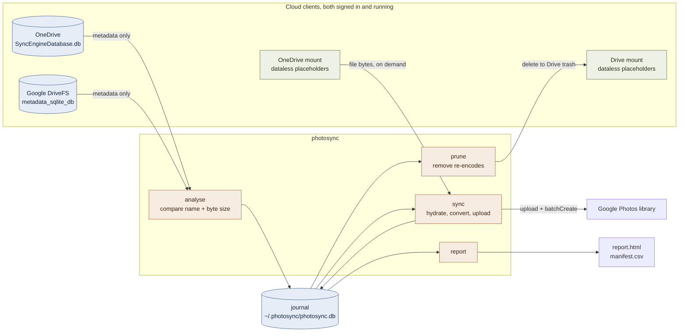

# photosync

Moves a OneDrive photo archive into the Google Photos library at full
resolution, and reports what happened to every file.

macOS only. It reads both cloud clients' local metadata and converts RAW through
`sips`, so it will not run anywhere else without changes.

## Why this exists

Samsung Gallery stops syncing to OneDrive on **30 September 2026**. Microsoft
and Samsung have both confirmed it. Photos already in OneDrive stay there and
remain viewable through the OneDrive app, but they disappear from the Gallery
app and nothing new is backed up that way again.

That leaves anyone with years of Samsung photos in OneDrive needing somewhere
else to put them. Google Photos is the obvious destination on an Android phone,
because backup from the Gallery is native and needs no third-party integration
to keep working.

The migration itself is not a copy job. A Google Photos library covering the
same years usually holds many of the photos already, but at the size Google
chose back when "High quality" storage was free. Those copies carry the original
filename, so a tool matching on name alone reports them as present and skips
them, and the original never moves. Working out which files are genuinely
missing is the part that needs care.

## How the pieces fit together



Two things the diagram is there to show. `analyse` never touches the mounts, only
the two metadata databases, which is why the comparison is effectively free.
File bytes are read exactly once, during `sync`, and only for files that are
actually going.

## Prerequisites

Everything below has to be true before the first command will work.

**Both cloud clients installed, signed in, and running at the same time.**
photosync reads OneDrive's sync database and Google's DriveFS cache in the same
pass, so both need to have finished their initial sync. Check that these two
paths exist and are populated:

```bash
ls ~/Library/CloudStorage/OneDrive-Personal
ls ~/Library/CloudStorage/GoogleDrive-you@gmail.com/My\ Drive
```

**The OneDrive folder you want synced must be visible in the mount.** Files can
be online-only placeholders, which is the normal case and costs nothing, but a
folder excluded from sync entirely will not appear in the database and photosync
will not see it.

**Somewhere to put new photos as well.** photosync moves what is already in
OneDrive. It does nothing about the phone. Turn on Google Photos backup in the
Gallery before 30 September 2026, or new shots stop being backed up anywhere
once the Samsung integration goes.

**Google storage to hold the result.** Uploads go in at original quality and
count against the account's quota. Check the archive size before starting:
`photosync analyse` prints it.

**Go 1.22 or later**, to build. No cgo, so no compiler toolchain beyond Go
itself.

**macOS.** `sips` handles RAW conversion and both metadata databases are in
macOS-specific locations.

**A Google Cloud OAuth client**, covered under Configuration below. This is the
only step that takes real time, about ten minutes in the console.

Optional but worth checking: free disk space. Hydrating placeholders caches them
locally and macOS gives no supported way to evict them programmatically, so a
large transfer wants headroom of roughly the size it is moving.

## Installation

```bash
git clone https://github.com/mrvladis/photosync.git
cd photosync
go build -o bin/photosync ./cmd/photosync
```

That is the whole build. No cgo, no external libraries to install, and the
SQLite driver is pure Go.

## Configuration

Two files, both in `~/.photosync`, neither of them in the repository.

### The config file

```bash
mkdir -p ~/.photosync
cp config.example.json ~/.photosync/config.json
```

```json
{
  "source": "Pictures/Camera Roll",
  "target": "Google Photos",
  "account": "you@gmail.com",
  "album_prefix": "Camera Roll"
}
```

`source` is a path inside OneDrive. `target` is a path inside My Drive to
compare against. `account` selects which Drive mount to read. Any value can be
overridden per command with a flag, so a one-off `--source` does not mean
editing the file.

### Google credentials

You need your own Google Cloud OAuth client. rclone's Google Photos backend is
scheduled for removal and its shared client id stops working during 2026, so
photosync talks to the Photos Library API directly.

1. Create a project at <https://console.cloud.google.com/>.
2. Enable the **Photos Library API**.
3. **Google Auth Platform, Get started.** App name, your email, user type
   External.
4. **Audience, Publish app**, so the status reads In production. A project left
   in Testing issues refresh tokens that expire after seven days, and a large
   transfer runs longer than that. An unverified production app shows a "Google
   hasn't verified this app" warning once; the 100-user lifetime cap does not
   bite for personal use.
5. **Data Access, Add or remove scopes.** Both entered manually:
   ```
   https://www.googleapis.com/auth/photoslibrary.appendonly
   https://www.googleapis.com/auth/photoslibrary.readonly.appcreateddata
   ```
6. **Clients, Create client, Desktop app.** Save the JSON as
   `~/.photosync/client_secret.json`.

```bash
photosync auth
```

## Execution

Work up to the real run in stages. Analysing costs nothing and changes nothing,
the dry run rehearses the same code path offline, and the pilot puts a handful
of real files in front of Google before the archive follows.

### 1. Analyse

```bash
photosync analyse
```

Reads both metadata databases, compares them, writes the work-list to the
journal and produces a first report. Nothing is downloaded and nothing is sent.
Safe to run as often as you like. The output tells you how many files are
missing, how many exist only as re-encodes, and how many days the transfer will
take.

### 2. Rehearse

```bash
photosync sync --dry-run --limit 200
```

Walks the same code path without contacting Google and without writing to the
journal.

### 3. Pilot

`--dry-run` never contacts Google, so none of the API code is exercised until a
real run. Start small and mixed:

```bash
photosync sync --ext arw,cr2,dng,mts,heic --limit 20
photosync sync --limit 50
photosync verify --sample 100
```

Format acceptance is the thing being tested. Google documents "most RAW files"
without naming extensions, so whether a given camera's RAW is accepted is not
knowable in advance. A rejection shows up as a per-item `create_rejected` in the
report. Include at least one file over 128 MB, which is the only way the chunked
resumable upload path runs.

Then open Google Photos and look at one of the albums before going further.

### 4. Run it

```bash
photosync sync
```

Interrupt whenever you need the machine back. It resumes from the journal, and
it stops on its own each day when the API allowance runs out.

### Everything else

```bash
photosync status                  # where the run has got to
photosync verify --sample 200     # read uploaded items back from the library
photosync prune                   # plan the deletion of Drive re-encodes
photosync prune --apply           # delete them, into Drive's 30-day trash
photosync report                  # regenerate report.html and manifest.csv
```

Flags on `sync`:

| Flag | Effect |
| :---- | :---- |
| `--ext arw,cr2,dng` | restrict the run to certain formats, useful for a pilot |
| `--limit N` | stop after N files |
| `--quality 90` | HEIF quality for converted RAW |
| `--convert-raw=false` | send the RAW itself |
| `--describe-with-path` | record each file's source path in its Photos description |
| `--workers 8` | concurrent hydrate and upload workers |
| `--daily-requests N` | API requests to spend per day |

## How it works

### Comparing without downloading

Files on both mounts are dataless placeholders. `stat` returns the size, but
reading one triggers a download, so an inventory pass that opens files would
pull the entire archive. Both clients maintain a local SQLite metadata database,
and that is what photosync reads:

| Client | Database |
| :---- | :---- |
| OneDrive | `~/Library/Application Support/OneDrive/settings/Personal/SyncEngineDatabase.db` |
| Google Drive | `~/Library/Application Support/Google/DriveFS/<account>/metadata_sqlite_db` |

Each database is copied with its write-ahead log before being read, so the
running client is never locked and never read mid-write. DriveFS matters here:
its WAL is routinely larger than the database file, and skipping it returns a
stale tree. Inventorying both sides takes under a second, six-figure file counts
included.

### Matching on size, not just name

Identity is `(normalised name, exact byte size)`. The size half is what
separates an original from the re-encode sitting under the same name.

No content hash is available to do better. OneDrive's sync database has hash
columns, but they are empty in practice: on the account this was written
against, six rows were populated out of a hundred and seventy thousand.
Drive's MD5 sits inside an opaque protobuf, and the two providers use different
algorithms anyway. Computing hashes locally would mean downloading everything,
which is the cost the whole design avoids.

Filenames are normalised first, so Drive's " (1)" collision suffixes don't cause
a renamed copy to be reported as missing.

### Converting RAW

An ARW or CR2 is tens of megabytes of sensor data that Google Photos can only
ever display as a generated preview. RAW is rendered to HEIF before upload and
the RAW itself is not sent.

| Format | Typical saving at quality 90 |
| :---- | ----: |
| Sony `.arw` | 55% |
| Canon `.cr2` | 57% |

Resolution is preserved: a 5184x3456 CR2 comes out at 5184x3456.

Conversion runs through macOS's own `sips`, which demosaics via Core Image
rather than pulling the embedded preview thumbnail. No third-party dependency,
and the same camera support the rest of the system has. The source file is never
modified.

Quality 100 is not the cautious choice. It produced a file larger than the RAW.
90 is the sensible ceiling; 80 saves another 20% with slight softening under a
hard crop.

### Surviving a run measured in days

Every file's state lives in a SQLite journal, so an interruption costs at most
one batch of in-flight uploads. The report is built from that recorded state
rather than from a re-scan, which means the report and the transfer cannot
disagree with each other.

## What paces a large run

Requests, not bandwidth. The Photos Library API allows 10,000 requests per
project per day, and byte uploads count against the same allowance. The cost is
roughly one request per file plus one per fifty for batch creation. Divide the
file count by 10,000 to get the number of days, and the connection speed makes
no difference to it.

photosync records the daily spend in the journal, refuses to start a batch it
cannot finish inside the day's budget, and stops with a message rather than
spending the remainder on 429s. Run it again the next day and it continues from
where it stopped. The day boundary is midnight Pacific, because that is when
Google resets the quota. Not local midnight, and not UTC.

Second-order, OneDrive rehydration runs at about 12 MB/s across 24 parallel
readers.

**Disk space.** Hydrating a placeholder caches it locally, and macOS offers no
supported way to evict it programmatically. The run pauses if free space falls
below `--free-space-floor-gb` (default 50) and resumes on its own once space
appears. To reclaim space mid-run, select the finished folders in Finder and
choose Remove Download.

## Two things to understand before running it

**The library cannot be enumerated.** Since 31 March 2025 an application can
read back only the media it created itself. "Already present" is therefore
judged against the Drive folder rather than the live Photos library. Blind
uploading is safe because Google Photos deduplicates byte-identical uploads
within an account, so re-sending a file that is already there adds no second
copy.

**Originals can land beside existing compressed copies.** A photo that reached
the library previously at storage-saver quality has different bytes from the
original, so deduplication will not merge them and both will exist. That follows
from asking for originals, but it looks like duplication in the Photos app.

## Deletion safety

`prune` is the only destructive command. The matching behind it is name-based,
so the bar is high. A Drive copy is deleted only when four conditions hold:

1. exactly one source file carries that name,
2. exactly one Drive file carries it,
3. the Drive copy is strictly smaller than the original, and
4. the original has a confirmed media item id in the library.

Everything else goes to a review list in the report instead of the delete queue:
an ambiguous name shared by several files, a Drive copy that is larger than the
original, an original not yet uploaded. Deletions go through the Drive mount,
which moves them to Drive's trash and keeps them recoverable for 30 days.

## Output

Written to the state directory, `~/.photosync` by default:

- `report.html` - verdicts, per-type and per-album progress, failures with
  reasons, the prune plan, and the caveats above.
- `manifest.csv` - one row per file: name, path, bytes, kind, verdict, Drive
  counterparts and their sizes, transfer state, album, media item id, attempts,
  error, date taken, modified, uploaded at.
- `photosync.db` - the journal every number is derived from.
- `client_secret.json` and `token.json` - your credentials.

None of that belongs in a repository. The config file, journal, report and
manifest all name real files from your archive, so they stay in the state
directory and `.gitignore` covers them even if `--state` is pointed at the
working tree.

## Layout

```
cmd/photosync         CLI
internal/inventory    reads both clients' metadata databases
internal/match        (name, size) comparison and work-list construction
internal/journal      durable transfer state
internal/gphotos      Photos Library API: OAuth, uploads, batchCreate
internal/convert      RAW to HEIF via sips
internal/transfer     the run loop: hydrate, convert, upload, create, commit
internal/prune        gated deletion of Drive re-encodes
internal/report       HTML report and CSV manifest
```

```bash
go test ./...
```

## Open items

- Album membership is set at creation. Files added to a OneDrive folder after
  its album exists are appended to the same album on the next `analyse`, but
  renaming the folder creates a second album rather than renaming the first.
- `verify` reads items back one request at a time, which is why it samples by
  default rather than checking everything.
- Eviction of hydrated OneDrive files is manual. If a supported API for it
  appears, the free-space guard should call it instead of pausing.

## Licence

MIT.
